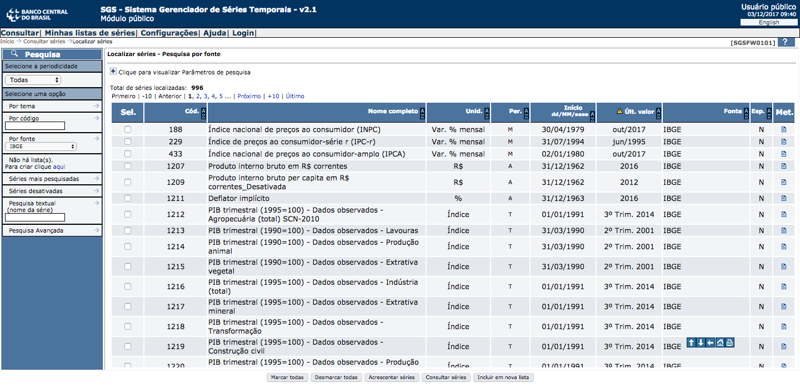

```{r setup, include=FALSE}
options(htmltools.dir.version = FALSE)
```

# rbcb

`rbcb` é um pacote R para acessar dados disponibilizados pelo Banco Central do Brasil (BCB).

Instale `rbcb` do [Github](https://github.com/wilsonfreitas/rbcb):

```{r eval=FALSE, tidy=FALSE}
devtools::install_github("wilsonfreitas/rbcb")
```

ou do [CRAN](https://cran.r-project.org):

```{r eval=FALSE, tidy=FALSE}
install.packages("rbcb")
```

---

```{r warning=FALSE, fig.height=5, fig.width=10, cache=TRUE}
IBOVESPA <- rbcb::get_series(7,
                             last = 756, # 3 anos
                             as = "xts")
plot(IBOVESPA)
```

---

```{r warning=FALSE, fig.height=5, fig.width=10, cache=TRUE}
IPCA <- rbcb::get_series(433,
                         start_date = "2004-01-01",
                         as = "ts",
                         ts_options = list(frequency = 12,
                                           start = c(2014, 1)))
monthplot(IPCA, main = "IPCA agrupado em meses")
```

---

```{r warning=FALSE, fig.height=6, fig.width=10, cache=TRUE}
USDBRL <- rbcb::get_currency("USD",
                             start_date = "2014-01-01",
                             end_date = "2017-11-30",
                             as = "xts")
plot(USDBRL$ask, main = "USDBRL ask price")
```

---
class: inverse, middle, center

# `get_series`

---

# `get_series`

Baixa séries temporais do [SGS](https://www3.bcb.gov.br/sgspub/localizarseries/localizarSeries.do?method=prepararTelaLocalizarSeries) (Sistema de Gestão de Séries Temporais).

```{r eval=FALSE}
rbcb::get_series(code, start_date, end_date, last, as)
```

- `code`: código númerico que identifica as séries temporais.
  - Exemplos: IBOVESPA = 7, IPCA = 433, Dólar = 1
  - Os códigos são obtidos na busca do [SGS](https://www3.bcb.gov.br/sgspub/localizarseries/localizarSeries.do?method=prepararTelaLocalizarSeries)
  
- `start_date` e `end_date`: datas do intervalo desejado.
  - Se `start_date = NULL` retorna dados desde o começo da série
  - Se `end_date = NULL` retorna dados até a última data disponível
  
- `last`: retorna os últimos `last` pontos da série
  - Se `last` é fornecido `start_date` e `end_date` são ignorados
  
- `as`: define o tipo de retorno. O padrão é `"tibble"` e as alternativas são `"xts"`, `"ts"`, `"data.frame"` ou `"text"` que retorna o JSON recebido.

---

# Onde encontrar as séries?

Encontre o `code` das séries no [SGS](https://www3.bcb.gov.br/sgspub/localizarseries/localizarSeries.do?method=prepararTelaLocalizarSeries).


---

# Exemplo de busca - séries do IBGE



---
class: inverse, middle, center

# `get_series`

## Dicas

---

# Diferentes retornos (1)

`tibble` (padrão), `xts`, `ts`, `data.frame` e `text` que retorna o JSON.

.pull-left[

```{r warning=FALSE, cache=TRUE}
rbcb::get_series(
  7, last = 5
)
```

]

.pull-right[

```{r warning=FALSE, cache=TRUE}
rbcb::get_series(
  7, last = 5,
  as = 'xts'
)
```

]

---

# Diferentes retornos (2)

As séries `ts`<sup>*</sup> podem ser configuradas no argumento `ts_options`.

```{r warning=FALSE, cache=TRUE}
rbcb::get_series(
  433, start_date = "2017-01-01", end_date = "2018-01-01",
  as = 'ts', ts_options = list(frequency = 12, start = c(2017, 1))
)
```

Os elementos de `ts_options` são passados como argumentos para `ts`.

.footnote[[*] Indicado para séries com frequência regular: mensais, anuais, trimestrais, etc.]

---

# Nomear as séries

.pull-left[

### sem nome

```{r warning=FALSE, comment='', cache=TRUE}
rbcb::get_series(
  7, last = 5,
  as = 'xts'
)
```

]

.pull-right[

### com nome

```{r warning=FALSE, comment='', cache=TRUE}
rbcb::get_series(
  7, last = 5,
  as = 'xts', name = "IBOVESPA"
)
```

]

.footnote[Objetos `ts` ignoram o atributo `names` que define os nomes das variáveis.]

---
class: middle, inverse, center

# `get_currency`

---

# `get_currency`

Baixa as séries temporais de moedas do site do BCB.

As cotações das séries são em reais (BRL).

```{r eval=FALSE}
rbcb::get_currency(symbol, start_date, end_date, as)
```

- `symbol`: código que identifica a moeda.
  - Exemplos: USD = dólar americano, JPY = íene, TRY = líra turca
  - Para encontrar o código de todas as moedas executar `rbcb::list_currencies()`
  
- `start_date` e `end_date`: datas do intervalo desejado.
  - Se `start_date = NULL` retorna dados desde o começo da série
  - Se `end_date = NULL` retorna dados até a última data disponível
  
- `as`: define o tipo de retorno. O padrão é `"tibble"` e as alternativas são `"xts"`, `"ts"`, `"data.frame"` ou `"text"` que retorna o JSON recebido.

---

# Para listar todas as moedas disponíveis

```{r warning=FALSE}
rbcb::list_currencies()
```

---

```{r warning=FALSE, fig.height=5, fig.width=10, cache=TRUE}
ccr_USD <- rbcb::get_currency("USD", as = "xts",
                              start_date = "2014-01-01",
                              end_date = "2017-11-30")
ccr_EUR <- rbcb::get_currency("EUR", as = "xts",
                              start_date = "2014-01-01",
                              end_date = "2017-11-30")
ccr <- merge(ccr_EUR$ask, ccr_USD$ask)
colnames(ccr) <- c("EUR", "USD")
plot(ccr, legend.loc = "topleft", main = "")
```
